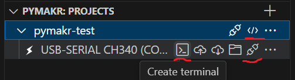

## FAQ

[//]: ################################

Performance

Duration for a loop executing 1000 x [rgb_to_hsv](https://github.com/kai-morich/lms-esp32-pybricks-info/blob/main/gy-33/gy33_color.py#L4):

| Hardware | Duration [msec] |
| --------- | --------- |
| typical PC | &nbsp;&nbsp;&nbsp;&nbsp;0.4 |
| LMS-ESP32 | 280 |
| Spike with Pybricks | 640 |

It's slower by orders of magnitude!

You should be aware that a `rh.call(...)` already takes ~10 msec.

[//]: ################################

IDE

## Thonny

Start simple with [Thonny](https://thonny.org/). Thonny typically edits files directly on the device, so you have no local copy.

## VS Code + Pymakr

To have a local copy, git integration, ... use VS Code with _Pymakr Preview_ extension. The extension is not updated since late 2022, but works most of the time.  
Sometimes gets stuck during file transfer and only solution I found so far is restarting VS code with <kbd>Ctrl</kbd>+<kbd>Shift</kbd>+<kbd>P</kbd> 'Reload Window' command.  
Usage is a bit obscure, after configured you basically need these 3 underlined buttons in the Explorer tree that are only shown when hovering over the line.\

For syntax highlighting add the micropython-esp32-stubs to your `typings` folder as described [here](https://micropython-stubs.readthedocs.io/en/main/) and
add this folder to `py_ignore` in your `pymakr.conf` file.

Neopixel and other functionality is already included in the standard MicroPython distribution, but some modules are LMS-ESP32 specific, so you should copy additional files into your typings folder:

| module | file |
| ------ | ---- |
| [PUPRemote](https://docs.antonsmindstorms.com/en/latest/Software/PUPRemote/docs/index.html) | [pupremote.py](https://github.com/antonvh/PUPRemote/blob/main/src/pupremote.py) |
| mpy_robot_tools [servo](https://docs.antonsmindstorms.com/en/latest/Software/mpy-robot-tools/Docs/index.html#mpy-robot-tools-servo-module) | [servo.py](https://github.com/antonvh/mpy-robot-tools/blob/master/mpy_robot_tools/servo.py) |
| mpy_robot_tools ... | ... |

[//]: ################################

Strapping Pins

Some pins of the ESP32 have special behaviour during boot time, these are called _strapping pins_.
  
Pins 0,2,12,15 at the [IO header](https://www.antonsmindstorms.com/docs/lms-esp32-v2-pinout/) should be avoided unless you really know how to handle them.

[//]: ################################

5V Tolerance

The datasheet says the maximum voltage at IO pins is 3.6V, so does not look 5V tolerant.
Various sources on the web say that it is practically 5V tolerant.

So should work with 5V powered sensors, but we are on the safer side, if the data lines are 3.3V only.

| sensor | 3.3V data lines  | details |
| ------ | ----- | ------- |
| gy-33 | ok | Can be powered with 3.3V or 5V. Has an onboard 3.3V  regulator and the 3K9 pull-up resistors are behind the regulator |
| vl53l0x | ok, use 3.3V power | Can be powered with 3.3V or 5V. Has an onboard 3.3V regulater, but the 10K I2C pull-up resistors are connected to the input voltage |
| pixy2 | ok, use 3K3 pull-up resistors to 3.3V | Is 5V powered but data lines have 3.3V level |

[//]: ################################

More than 8 commands

Use [MicroPython firmware](https://firmware.antonsmindstorms.com/) >= 20250617

[//]: ################################

Time between rs.process()

You must not use more than 200msec in betweeen, else the connection is reset by Spike and if 5V powered by Spike (`PUPRemoteSensor(power=True)`) the power is turned off.

If you have a device that has a long initialization time and is Spike 5V powered, you have to call `rs.process()` before to turn on power and make the operation interruptable, like `pixy.init(callback=rs.process)` to keep power on.

[//]: ################################

wait_ms parameter at PUPRemoteHub.call function

<dl>
  <dt>Symptom</dt><dd>A sensor returns wrong / outdated values</dd>
  <dt>Reason</dt><dd>The sensor took longer than the wait time</dd>
</dl>
  
- If the call takes longer than the specified wait time, the previous value is returned without any notice or error. 
- The actual time a call should not exceed is wait_ms + roughly 5msec.
- I observed up to ~50 commands being queued and executed asynchronously

