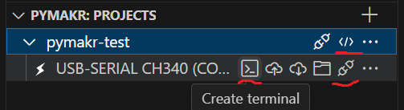

## FAQ

[//]: ################################
<details><summary>IDE</summary>

## Thonny

Start simple with [Thonny](https://thonny.org/). Thonny typically edits files directly on the device, so you have no local copy.
To have a local copy, git integration, ... use VS Code with a MicroPython aware extension.

## VS Code + extension

| Extension | Development Experience | Comment |
| ---- | ------- | ------- |
| [MicroPico](https://marketplace.visualstudio.com/items?itemName=paulober.pico-w-go) | :green_circle: | comes with MicroPython stubs. Works well with ESP32 as of version 4.4.0. |
| [Pymakr](https://marketplace.visualstudio.com/items?itemName=pycom.Pymakr) | :yellow_circle: | not maintained any more |
| [MPY Workbench](https://marketplace.visualstudio.com/items?itemName=DanielBucam.mpy-workbench) | :yellow_circle: |
| [Micropython-Workbench](https://marketplace.visualstudio.com/items?itemName=WebForks.MicroPython-WorkBench) | :yellow_circle: | fork of MPY Workbench |

### MicroPico 

After _Ctrl+Shift+P > MicroPico: Initialize MicroPico Project_ use the _All commands_ button in the status bar to download MicroPython stubs and in Global Settings add _upload_ and _uploadproject_ to the statusbar buttons.

Add to your project `.vscode/settings.json`:
```json
    "micropico.softResetAfterUpload": true,
    "python.analysis.diagnosticSeverityOverrides": {
        "reportMissingModuleSource": "none"
    }
```

Use the _Upload_ button if only the current file was edited to upload and restart `main.py`. If more files were changed use _Upload Project_.

### Pymakr

The  _Pymakr Preview_ extension is not updated since late 2022, but works most of the time.  
Sometimes does not respond to commands and using <kbd>Ctrl</kbd>+<kbd>C</kbd> in the terminal helps.  
Sometimes gets stuck during file transfer and only solution I found so far is restarting VS code with <kbd>Ctrl</kbd>+<kbd>Shift</kbd>+<kbd>P</kbd> 'Reload Window' command.  
Usage is a bit obscure, after configured you basically need these 3 underlined buttons in the Explorer tree that are only shown when hovering over the line.\


## VS Code Syntax Highlighting

MicroPico comes with stubs. For all other extensions you can put the micropython-esp32-stubs to your `typings` folder as described [here](https://micropython-stubs.readthedocs.io/en/main/) and exclude upload of this folder with `.mpy-workbench/.mpyignore` or `pymakr.conf/py_ignore`.

</details>


[//]: ################################
<details><summary>Additional Modules</summary>

Some files are not included in all [firmwares](https://firmware.antonsmindstorms.com/) or are outdated. Copy these files into your project. If you use the files from the firmware but want syntax highlighting, copy into `typings` folder instead.
| module | file | comment | 
| ------ | ---- |-------- |
| [PUPRemote](https://docs.antonsmindstorms.com/en/latest/Software/PUPRemote/docs/index.html) | [pupremote.py](https://github.com/antonvh/PUPRemote/blob/main/src/pupremote.py) + [lpf2.py](https://github.com/antonvh/PUPRemote/blob/main/src/lpf2.py) | could be outdated in the firmware, e.g. missing PyBricks 4.0 support |
| [rcservo](https://github.com/antonvh/rcservo) | [servo.py](https://github.com/antonvh/rcservo/blob/main/servo.py) | not included in all firmwares |
</details>

[//]: ################################
<details><summary>Strapping Pins</summary>

Some pins of the ESP32 have special behaviour during boot time, these are called _strapping pins_.
  
Pins 0,2,12,15 at the [IO header](https://www.antonsmindstorms.com/docs/lms-esp32-v2-pinout/) should be avoided unless you really know how to handle them.

Pins 0,2,15 are ok for usage like I2C having pull-up resistors, but pin 12 must not be pulled up during boot.

</details>

[//]: ################################
<details><summary>5V Tolerance</summary>
The datasheet says the maximum voltage at IO pins is 3.6V, so does not look 5V tolerant.
Various sources on the web say that it is practically 5V tolerant.


So should work with 5V powered sensors, but we are on the safer side, if the data lines are 3.3V only.

| sensor | 3.3V data lines  | details |
| ------ | ----- | ------- |
| gy-33 | ok | Can be powered with 3.3V or 5V. Has an onboard 3.3V  regulator and the 3K9 pull-up resistors are behind the regulator |
| vl53l0x | ok, use 3.3V power | Can be powered with 3.3V or 5V. Has an onboard 3.3V regulater, but the 10K I2C pull-up resistors are connected to the input voltage |
| pixy2 | ok, use 3K3 pull-up resistors to 3.3V | Is 5V powered but data lines have 3.3V level |
</details>

[//]: ################################
<details><summary>More than 8 PUPRemote commands</summary>

Use MicroPython [firmware](https://firmware.antonsmindstorms.com/) >= 20250617
</details>

[//]: ################################
<details><summary>Type warnings at / after PUPRemoteHub.call()</summary>

Use MicroPython [firmware](https://firmware.antonsmindstorms.com/) > 20251228 or type hint comments:

VSCode shows Pylance warnings as red weavy underlines at the rh.call() line or at the next usage of the result.

As `rh.call()` can return different number of values and types, the _Pylance_ based type checking does not work out of the box. With `# type: ...` you can define the type and with `# pyright: ignore[reportAssignmentType]` the assignment is silenced.  

```python
    b = rh.call('tof') # type: int # pyright: ignore[reportAssignmentType]
    b = b + 1
```
</details>

[//]: ################################
<details><summary>Performance</summary>

Duration for a loop executing 1000 x [rgb_to_hsv](https://github.com/kai-morich/lms-esp32-pybricks-info/blob/main/gy-33/gy33_color.py#L4):

| Hardware | Duration [msec] |
| --------- | --------- |
| typical PC | &nbsp;&nbsp;&nbsp;&nbsp;0.4 |
| LMS-ESP32 | 280 |
| Spike with Pybricks | 640 |

It's slower by orders of magnitude!

Avoid f-strings in timing sensitive loops, e.g  `print(f'x {a} {b} {c}')` takes 1.3 msec and `print('x',a,b,c)` takes 0.4 msec.

You should be aware that a `rh.call(...)` already takes ~10 msec.
</details>
