# Comparison of different color sensors

Sensors used with the [LMS-ESP32 board](https://www.antonsmindstorms.com/product/wifi-python-esp32-board-for-mindstorms/) from Antons Mindstorms and LEGO&reg; Spike running [Pybricks](https://pybricks.com/).

## Devices

| Name:      | Quality: | Lag:    | Measurement Time: |
| ---------- | -------- | ------- | ----------------- |
| Lego 45605 | ++       | 0       | 9-10 msec         |
| TCS34725   | +        | 15 msec | 2.4 msec steps    |
| APDS9960   | (+)      | 10 msec | 2.78 msec steps   |
| GY-33      | -        | 75 msec | 2.4, 24, 100 msec |

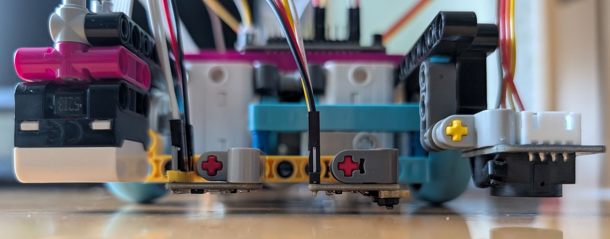

## Lag comparison
All sensors were placed one beam above the ground and adjusted to the same position at very low speed when driving across a black line:
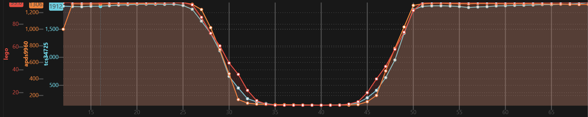
Then the lag to the Lego sensor was measured at 200 mm/sec:
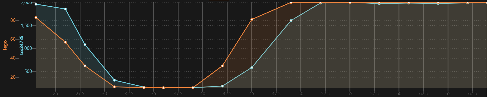
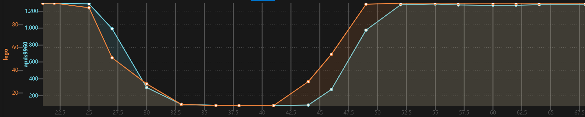
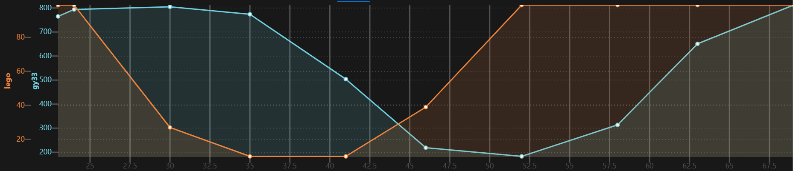

## Data comparison

Test cases:
1. Printed grey gradient: white to black
1. Printed color bars: white, 0°=360° (red), 300°, 240° (blue), 180°, 120° (green), 60° (yellow), 0°=360° (red):
1. Lego brick color: white, red, blue, light-blue, green, light-green, yellow, red:

### H'ue
1. 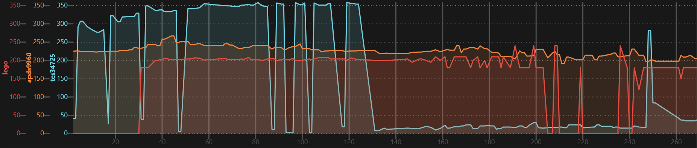
1. 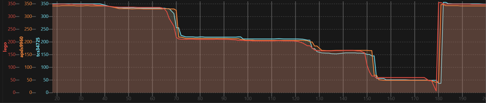
1. 

### S'aturation
1. 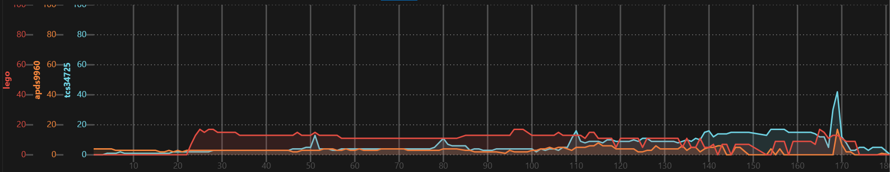
1. 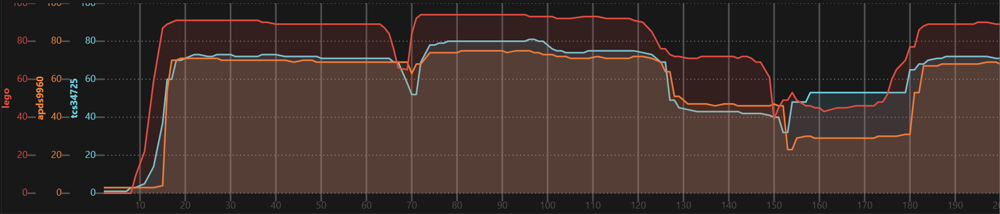
1. 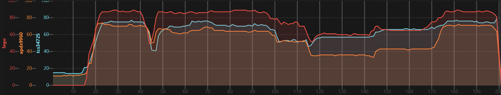

### V'alue
1. 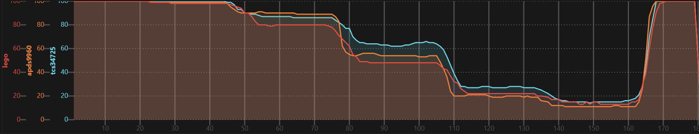
1. 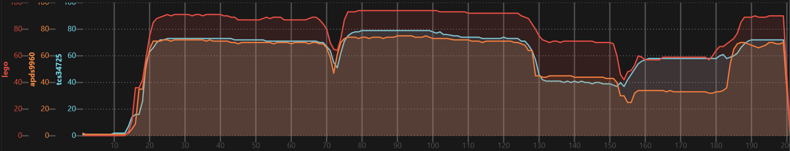
1. 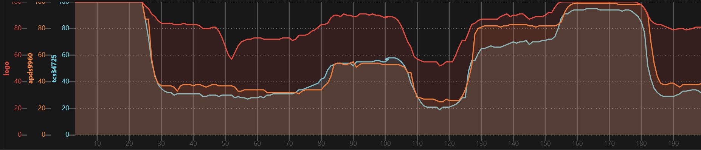

White paper at different distance from ground: 1 beam, +16mm, +32mm
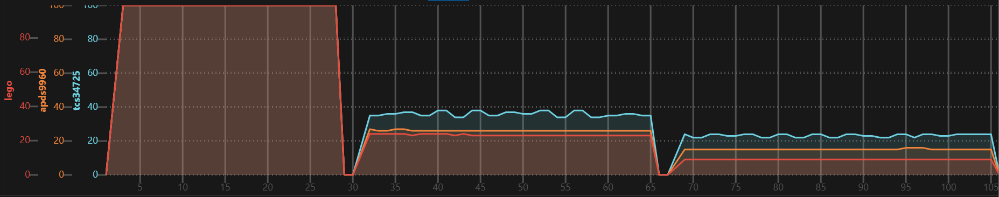


## Color processing

Preprocessing to HSV color space is best done on the LMS-ESP32 as it is twice as fast as the Lego Spike and only 4 instead of 8 bytes have to be transferred.

__White balance:__ The B'lue value is significantly lower than the others. Very likely caused by the non homogenous onboard LED. Adjust before all else.

__C'larity to V'alue__: The C'larity value from range 0..2100 or 0..1400 has to be converted to 0..100. Probably the Lego sensor does the same internally. With a function using two different slopes with transition at 80 I could get very close.

Has to be adapted per sensor, surface material and target colors, e.g.:
```python
def tcs34725_rgbc_to_hsv(r, g, b, c):
    c +=         g*0.025 + b*0.65 # white balance
    r, g, b = r, g*1.025,  b*1.65
    h, s, _ = rgb_to_hsv(r, g, b)
    if c < 1250:   v = c * 80/1250
    elif c < 1900: v = (c-1250)/(1900-1250)*20 + 80
    else:          v = 100
    return int(h*360), int(s*100), int(v)
```
Copy `rgb_to_hsv` function from https://github.com/python/cpython/blob/main/Lib/colorsys.py.

On the Lego Spike the HSV values can be converted to the _nearest_ color:

```python
def hsv_to_color(h, s, v):
    if s < 20:
        if   v > 60:        return Color.WHITE
        elif v > 30:        return Color.GRAY
        else:               return Color.BLACK
    else:
        if h > 300 or h < 30: return Color.RED
        elif h < 75:          return Color.YELLOW
        elif h < 190:         return Color.GREEN
        else:                 return Color.BLUE        
```

## TCS34725

I tested a 3x3 stud sized module and a 4x1.5 sized module. Both come with onboard LED.

I used the [adafruit/Adafruit_TCS34725](https://github.com/adafruit/Adafruit_TCS34725) library with `adafruit_bus_device/i2c_device.py` from [AHSPC/adafruit_i2c_device_micropython](https://github.com/AHSPC/adafruit_i2c_device_micropython/blob/main/i2c_device.py) 

```python
import ...
from adafruit_tcs34725 import TCS34725

cs = TCS34725(SoftI2C(scl=Pin(4), sda=Pin(5), freq=100000))
cs.gain = 4
cs.integration_time = 12
cs.active = True

def tcs34725_rgbc_to_hsv(r, g, b, c):
    c +=         g*0.025 + b*0.65 # white balance
    r, g, b = r, g*1.025,  b*1.65
    h, s, _ = rgb_to_hsv(r, g, b)
    if c < 1250:   v = c * 80/1250
    elif c < 1900: v = (c-1250)/(1900-1250)*20 + 80
    else:          v = 100
    return int(h*360), int(s*100), int(v)

rs = PUPRemoteSensor(power=True)
rs.add_channel('cs','HBB')

while True:
    rs.process()
    if cs.interrupt:
        cs.interrupt = False
        r, g, b, c = cs.color_raw
        h, s, v = tcs34725_rgbc_to_hsv(r, g, b, c)
        rs.update_channel('cs', h, s, v)
```

## APDS9960

> [!NOTE]
> The device is EOL since end of 2024 and not produced any more. There are many fake devices!

One module was a fake device, only partially functional. A different one was ok.

The modules have no onboard LED, so I had to solder a tiny extension board with an SMD LED.

I used the [liske/python-apds9960](https://github.com/liske/python-apds9960) library and contributed some enhancements.

```python
import ...
from apds9960 import uAPDS9960

cs = uAPDS9960(SoftI2C(scl=Pin(4), sda=Pin(5), freq=100000))
cs.enableLightSensor()
cs.setLightIntegrationTime(15) # x*2.78ms = 13.9ms
cs.setAmbientLightGain(apds9960.const.APDS9960_AGAIN_4X)

def apds9960_rgbc_to_hsv(r, g, b, c):
    c +=          g*0.25 + b*0.40 # white balance
    r, g, b, = r, g*1.25,  b*1.40
    h, s, _ = rgb_to_hsv(r, g, b)
    if c < 750:    v = c * 80/750
    elif c < 1300: v = (c-750)/(1300-750)*20 + 80
    else:          v = 100
    return int(h*360), int(s*100), int(v)

rs = PUPRemoteSensor(power=True)
rs.add_channel('cs','HBB')

while True:
    rs.process()
    if cs.isLightAvailable():
        r, g, b, c = cs.readLight()
        h, s, v = apds9960_rgbc_to_hsv(r, g, b, c)
        rs.update_channel('cs', h, s, v)    
```

## GY-33

The board has a lens mount, which looks like a good protection against ambient light, but it is not necessary.

> [!NOTE]
> This devices contains a TCS34725 and an additional microprocessor. Due to the  high lag and limited configurability, I can not recommended it.

I used the [QuirkyCort/micropython-gy33](https://github.com/QuirkyCort/micropython-gy33/blob/main/gy33-uart/gy33_uart.py) library and contributed some enhancements.

```python
import ...
from gy33_uart import GY33_UART

cs = GY33_UART(UART(1, baudrate=115200, rx=Pin(20), tx=Pin(19)))
# initially connect with baudrate=9600 and execute gy33.set_baudrate(115200) once. 
# this switches the baud rate _permanently_ to 115k2 on next power on
#gy33.set_baudrate(115200)
cs.set_output(raw=True, lcc=False, processed=False) # speed up by disabling other responses
time.sleep_ms(200)
cs.set_integration_time(24)
time.sleep_ms(200) # required if it was > 24 before
cs.uart.read() # discard measurements with old integration time
cs.set_led(10)
if not cs.update(wait=1000): # connection check
    raise RuntimeError('gy33 not responding')

def gy33_rgbc_to_hsv(r, g, b, c):
    # todo: reuse tcs34725 code, but max value is lower, white balance is different, ...

rs = PUPRemoteSensor(power=True)
rs.add_channel('cs','HBB')

while True:
    rs.process()
    if gy33.update():
        r, g, b, c = gy33.get_raw()
        h, s, v = gy33_rgbc_to_hsv(r, g, b, c)
        rs.update_channel('cs', h, s, v)
```
