# Comparison of different ultrasonic and ToF (laser) distance sensors

Sensors used with the [LMS-ESP32 board](https://www.antonsmindstorms.com/product/wifi-python-esp32-board-for-mindstorms/) from Antons Mindstorms and LEGO&reg; Spike running [Pybricks](https://pybricks.com/).

# Devices:

| Name:      | Technology: | Interface:     | Measurement Time: | Distance Resolution | Jitter:  | Cost:  |
| ---------- | ----------- | ----------------- | -------------------------- | ---------- | -------- | ------ |
| Lego 45604 | ultrasonic  | Lego LPF2         | ~20msec                    | 1mm        | very low | high   |
| HC-SR04    | ultrasonic  | Echo / I2C / UART | ~8msec / ~10msec / ~12msec | 3mm        | very low | low    |
| RCWL-1601  | ultrasonic  | Echo / I2C / UART | like above                 | 3mm        | very low | low    |
| US-100     | ultrasonic  | Echo / UART       |                            |            |          | low    |
| VL53L0X    | ToF (laser) | I2C               | 20-...msec, default 35msec | 1mm        | high     | low    |
| VL53L4CD   | ToF (laser) | I2C               | 10-...msec, default 50msec | 1mm        | high     | medium |
| TMF8820    | ToF (laser) | I2C               | 6-230msec, default 32msec  | 1mm        | low      | high   |

# Tests

Diagrams per device:
1. standing still at ~100mm distance from wall  
-> shows jitter 
2. driving with brisk 200 mm/sec alongside a wall and passing a 4 by 6 brick.  
The _sensor_ data should have a 32x48mm dip at the location indicated by _ground_ data, which is a sticker scanned by a Lego Color Sensor.  
-> shows timing resolution and latency
3. driving with a 10° angle towards the wall  
-> shows distance resolution and linearity

Not all tests done here, e.g. temperature sensitivity of ultrasonic sensors and target object color sensitivitiy of some ToF sensors.

Impact of _bad_ values at 1. or 3. is unclear, a PID based wall follower could show which devices are suitable.

## Lego 45604 Distance Sensor 
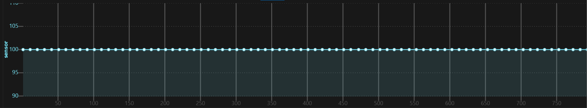
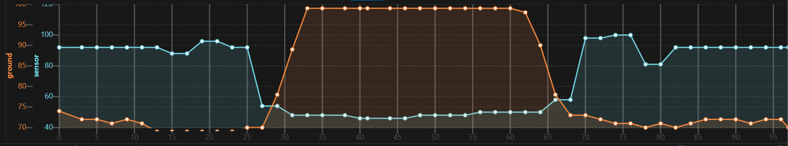
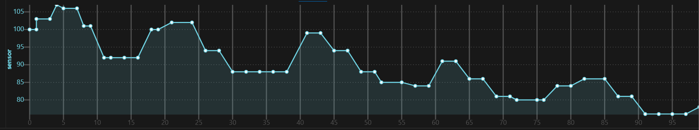

## HC-SR04
I used a variant with 3 chips on the back and solder jumper for I2C and UART. Works identical with 3.3V and 5V.

All interfaces return data with 3mm distance resolution. Tested timing resolution at 100mm distance, the time increases with larger distance.

Trigger/Echo interface: used with [rsc1975/micropython-hcsr04](https://github.com/rsc1975/micropython-hcsr04/blob/master/hcsr04.py) module.

I2C interface: write 0x01 to address 0x57, read 3 bytes from same address. Needs pull-up resistor at SDA. 

UART interface: write byte 0xA0, read 3 bytes at 9600 baud. See chinese data sheet [here](http://pan.baidu.com/s/1miNGWha).

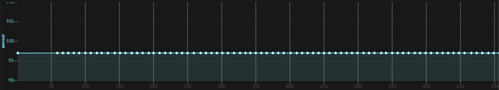
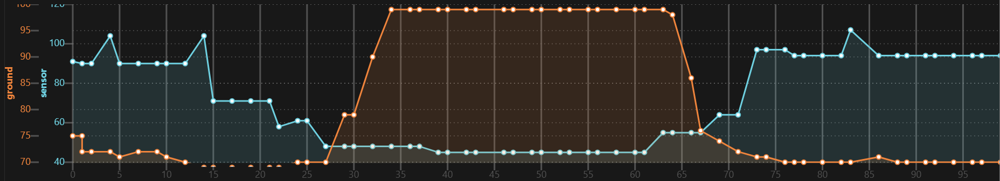
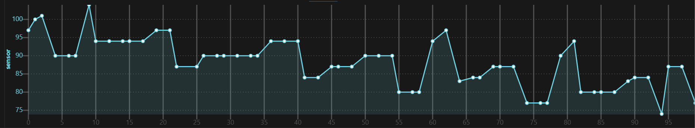

## RCWL-1601 
With single chip from RCWL instead of 3 chips, using same interfaces.

The 3rd image looks slightly better, might be better but could also be coincidence or device variation.
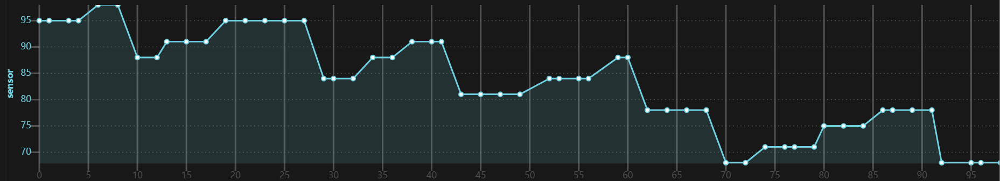

## US-100 

todo

## VL53L0X
See detailed analysis [here](../vl53l0x).

Diagram taken at default measurement time of ~30msec. Has higher jitter at lower measurement time.

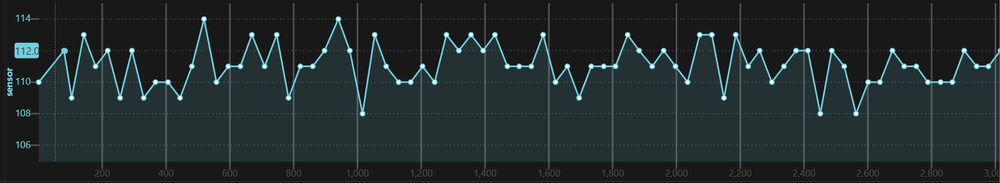
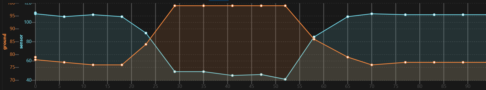
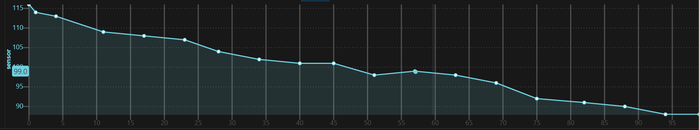

## VL53L4CD

Has narrower FoV and supports lower measurement time and lower minimum distance than VL53L0X. Precision looks similar. 

Tested with [AHSPC/VL53L4CD_micropython](https://github.com/AHSPC/VL53L4CD_micropython/blob/main/vl53l4cd.py) module using [AHSPC/adafruit_i2c_device_micropython](https://github.com/AHSPC/adafruit_i2c_device_micropython/blob/main/i2c_device.py).

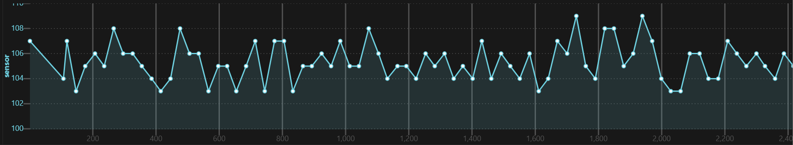
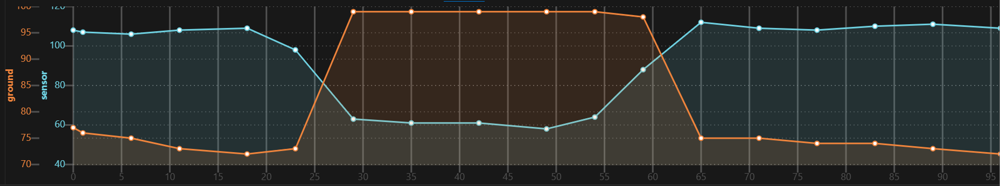
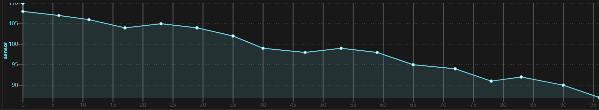

## TMF8820 

Used the _SparkFun Qwiic dToF Imager - TMF8820_ board with [K1ngGrim/tmf882X_micropython](https://github.com/K1ngGrim/tmf882X_micropython) library.

Basically no jitter, values not sensitive to target object color. No cover glass used, therefore no calibration performed (and not needed?). Each of the 9 SPADs returns a different distance, why?

With default setting the center SPAD seems overexposed when exactly perpendicular to a wall and reports flapping values. Issue gone if the sensor is looking slightly downwards or when using `tof.configure(spad_map_id=12)`.

For maximum performance use the functions used inside `tof.measure_frame()` in main loop and tof enable/disable command separately.

Diagrams taken at default measurement time of 32msec.

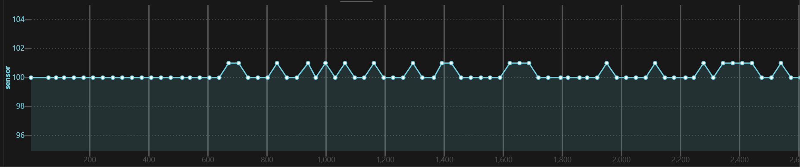
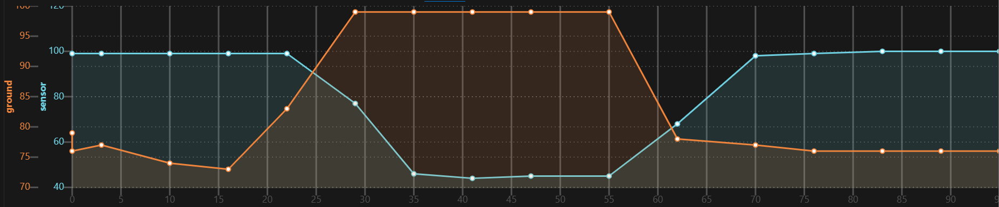
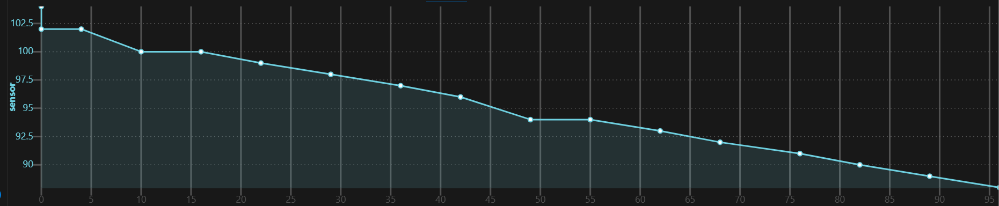
