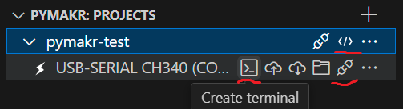

# Thonny

Start simple with [Thonny](https://thonny.org/). Thonny typically edits files directly on the device, so you have no local copy.

# VS Code + Pymakr

To have a local copy, git integration, ... use VS Code with _Pymakr Preview_ extension. The extension is not updated since late 2022, but works most of the time.  
Sometimes gets stuck during file transfer and only solution I found so far is restarting VS code with <kbd>Ctrl</kbd>+<kbd>Shift</kbd>+<kbd>P</kbd> 'Reload Window' command.  
Usage is a bit obscure, after configured you basically need these 3 underlined buttons in the Explorer tree that are only shown when hovering over the line.\

For syntax highlighting add the micropython-esp32-stubs to your `typings` folder as described [here](https://micropython-stubs.readthedocs.io/en/main/) and
add this folder to `py_ignore` in your `pymakr.conf` file.

Neopixel and other functionality is already included in the standard MicroPython distribution, but some modules are LMS-ESP32 specific, so you should copy additional files into your typings folder:

| module | file |
| ------ | ---- |
| [PUPRemote](https://docs.antonsmindstorms.com/en/latest/Software/PUPRemote/docs/index.html) | [pupremote.py](https://github.com/antonvh/PUPRemote/blob/main/src/pupremote.py) |
| mpy_robot_tools [servo](https://docs.antonsmindstorms.com/en/latest/Software/mpy_robot_tools.html#mpy-robot-tools-servo-module) | [servo.py](https://github.com/antonvh/mpy-robot-tools/blob/master/mpy_robot_tools/servo.py) |
| mpy_robot_tools ... | ... |

