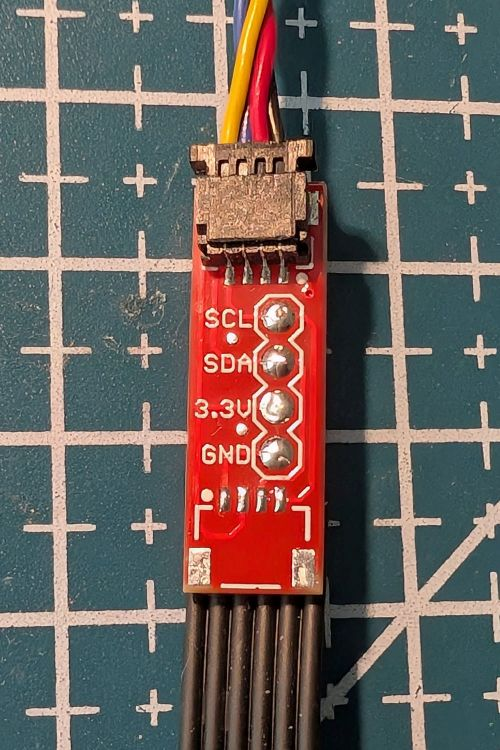
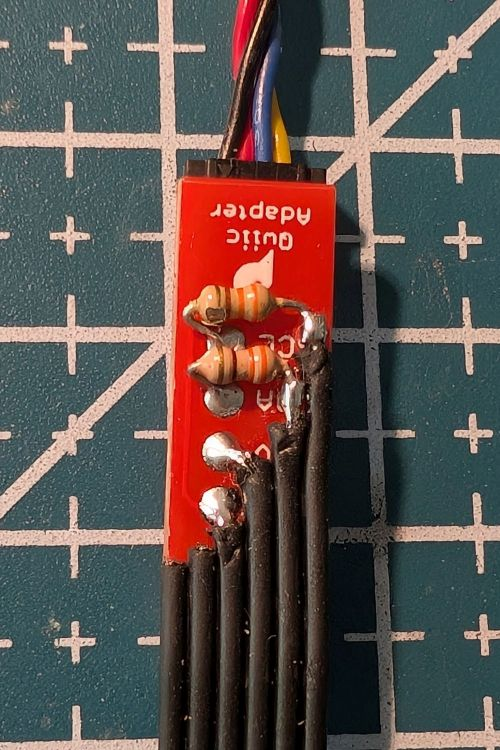

# Using the [OpenMV AE3](https://openmv.io/products/openmv-ae3) camera with the [LMS-ESP32 board](https://www.antonsmindstorms.com/product/wifi-python-esp32-board-for-mindstorms/) from Antons Mindstorms and LEGO&reg; Spike running [Pybricks](https://pybricks.com/)

# Connection

the Camera can be connected to the LMS-ESP32 with a _Qwiic_ cable or to the LEGO Spike with an aditional adapter consisting of

- [SparkFun Qwiic adapter](https://www.sparkfun.com/sparkfun-qwiic-adapter.html) board with one connector desoldered
- 2*330 Ohm series resistors for safety reasons
- LEGO Spike = WE-DO = Power Functions cable
- heat-shrink tubing

 

Note: double check polarity after soldering GND and 3.3V. Reversed polarity or connecting 8V to the SDA/SCL pins will fry the camera.

Communication works well with Anton's [uremote library](https://www.antonsmindstorms.com/2026/06/22/openmv-ae3-spike-line-follower/) to LMS-ESP32 and LEGO Spike.

