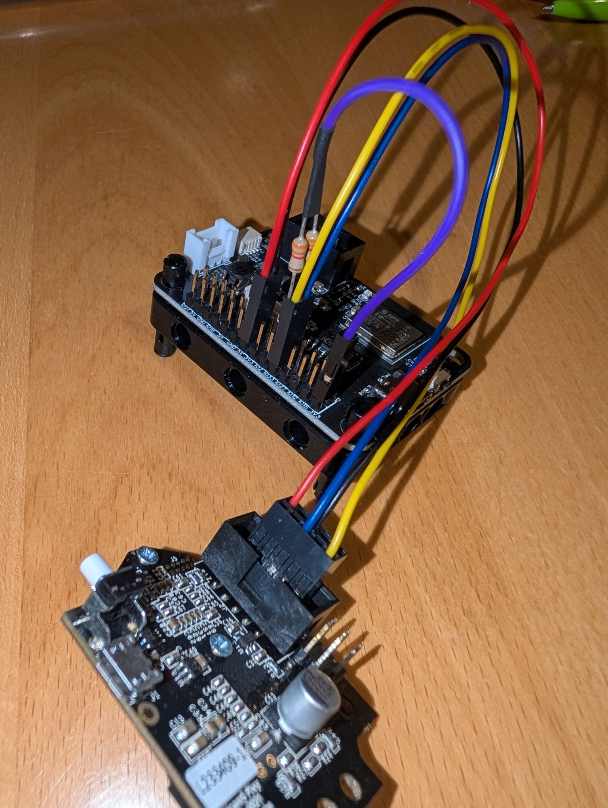

Using the [Pixy2](https://pixycam.com/pixy2/) camera with [indigoparadox/boxes_and_bots](https://github.com/indigoparadox/boxes_and_bots) library.

## LMS-ESP32 code:

```python
from neopixel import NeoPixel 
from machine import Pin, SoftI2C
from pupremote import PUPRemoteSensor
from pixy import CMUcam5 # copy from https://github.com/kai-morich/boxes_and_bots/blob/master/drivers/micropython/cmucam5/pixy.py
import sys, time

np = NeoPixel(Pin(25), 1) # onboard neopixel
def statusLed(r,g,b):
    np[0] = r,g,b
    np.write()

def sLamp(a, b):
    pixy.set_lamp(a, b)

def sBrit(v):
    pixy.set_brightness(v)

def gRGB(x, y):
    return pixy.get_rgb(x, y, 0)

try:
    statusLed(0, 0, 255) # blue = connection wait
    rs = PUPRemoteSensor(power=True)
    rs.add_command('sLamp', '', 'bb')
    rs.add_command('sBrit', '', 'B')
    rs.add_command('gRGB', 'BBB', 'HB')
    rs.process()

    statusLed(255, 255, 0) # yellow = initialize
    # PixyMon->Configure->Interface=I2C + address 0x54, scl+sda with 3k3 pull-up each to 3.3V
    pixy = CMUcam5(SoftI2C(freq=1000000, scl=Pin(32), sda=Pin(33)))
    pixy.init(callback=rs.process) # power turned off w/o periodic heartbeat
except Exception as e:
    statusLed(255, 0, 0) # red = error
    raise

statusLed(0, 255, 0) # green = ready
while True:
    try:
        rs.process()
    except Exception as e:
        if isinstance(e, KeyboardInterrupt):
            break
        sys.print_exception(e)
        statusLed(255, 0, 0) # red = failed
        time.sleep_ms(100)
        statusLed(0, 255, 0) # green = retry
```

## Pybricks code:
```python
from pybricks.parameters import Port
from pupremote_hub import PUPRemoteHub # copy from https://github.com/antonvh/PUPRemote/blob/main/src/pupremote_hub.py
import pixy_color # copy from example folder

rh = PUPRemoteHub(Port.A)
rh.add_command('sLamp', '', 'bb')
rh.add_command('sBrit', '', 'B')
rh.add_command('gRGB', 'BBB', 'HB')

rh.call('sLamp', 1, 1)
rh.call('sBrit', 60)

while True:
    r,g,b = rh.call('gRGB', 150, 100)
    h,s,v = pixy_color.rgb_to_hsv(r,g,b)
    c = pixy_color.hsv_to_color(h,s,v)
    print(f'rgb : {r:3} {g:3} {b:3}    hsv : {int(h*360):3} {int(s*100):3} {v:3}    color : {c}')
```

The camera can be connected with different [interfaces](interfaces.md). Use I2C with 3k3 pullup for SDA and SCL to 3.3V or connect in parallel with another I2C device already having integrated pullups.




