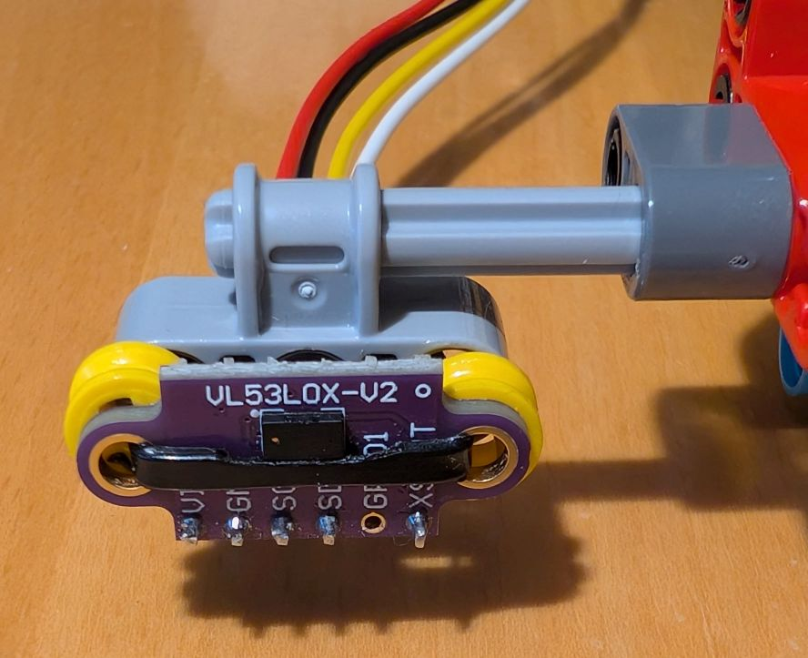
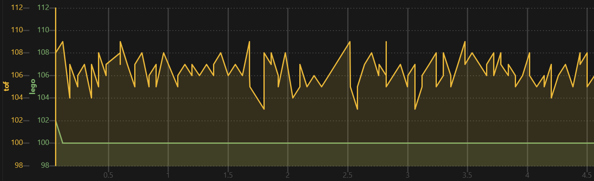
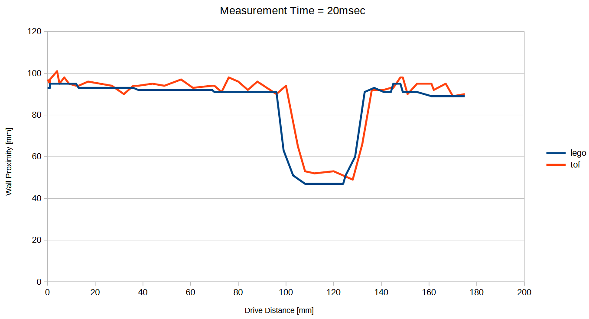
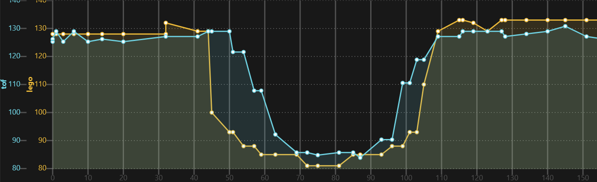

# Using a VL53L0X TOF (laser distance) sensor with the [LMS-ESP32 board](https://www.antonsmindstorms.com/product/wifi-python-esp32-board-for-mindstorms/) from Antons Mindstorms and LEGO&reg; Spike running [Pybricks](https://pybricks.com/)

If you only want to connect a single VL53L0X and expose it as a LEGO compatible sensor, follow [Antons article](https://www.antonsmindstorms.com/2024/05/02/lego-with-a-laser-distance-sensor/).

This document explains how to expose them with the PUPRemote framework and compares with the LEGO ultrasonic sensor.

## Mounting

Use a 3D printed case, countersunk M3 screws that fit nicely to the liftarm holes, ..., or simply zip ties:



## Latency

A LEGO ultrasonic sensor is directly attached to the LEGO Spike, but for the TOF sensor the data goes over one aditional hop (the LMS-ESP32) so it has a higher latency. By using one of the non-blocking variants, this can be minimized.

### Variant 1: Blocking `command`

Simplest code, but worst sample rate and high latency.

The call blocks until the measurement is ready. See code at the end.

As already mentioned in Anton's article, the VL35L0X by default needs approximately 30 milliseconds for a measurement, so you have to use `rh.call('tof', wait_ms=30)`, resulting in a round trip time of over 40 milliseconds.

### Variant 2: Non-Blocking `command`

Best sample rate, medium latency.

Values are calculated in the background and `rh.call('tof')` returns the latest value roughly each 13 milliseconds.

### Variant 3: Non-Blocking `channel`

Best sample rate, shortest latency. 

After the first call, channels are always non-blocking, unless you interleave with other command or other channel calls.

Values are calculated in the background and send to the Spike when a new value is available. The `rh.call('tof')` returns in less than a millisecond with the latest received value. As polling from LEGO Spike is omitted, the values are available approximately 5-6 milliseconds earlier than variant 2.

Requires >= MicroPython v1.25.0 firmware.


## Measurement Duration

The LEGO ultrasonic sensor returns a new value each 20 msec.

The VL32L0X has a configurable measurement duration, with 30 msec default and 20 msec minimum.


## Accuracy

The VL53L0X has limited accuracy and a high jitter. Check [here](https://forum.pololu.com/t/vl53l0x-not-very-accurate-at-all/) and [here](https://www.fpaynter.com/2022/03/new-wall-following-capability-for-wall-e3/) for discussion and correction strategies. 

The measured values are not exact and surprisingly depend on the color of the reflected object, e.g.
| Wall proximity | LEGO ultrasonic sensor | VL32L0x with white wall | VL32L0X with brown wall | VL32L0X with black wall |
| --- | --- | --- | --- | --- |
|  50 mm |  50 mm |  55 mm |  51 mm |  37 mm |
| 100 mm | 100 mm | 108 mm | 106 mm |  74 mm |
| 150 mm | 150 mm | 166 mm | 163 mm | 125 mm |
| 200 mm | 200 mm | 218 mm | 213 mm | 180 mm |

The LEGO ultrasonic sensor has basically no jitter. Depending on the measurement duration the VL32L0X values have a significant jitter, e.g.
| Measurement time | Jitter |
| -------- | ------- |
|  20 msec | +-6 mm  |
|  30 msec | +-4 mm  |
| 200 msec | +-1.5mm |



The limited accuracy was reproducible when attached to an Arduino.


## Libraries

I started with the https://github.com/antonvh/PUPRemote/blob/main/examples/emulate_dist_sensor/VL53L0X.py module, which is identical to [uceeatz/VL53L0X](https://github.com/uceeatz/VL53L0X/blob/master/VL53L0X.py) with replaced  `Timer` module.

the `set_measurement_timing_budget(budget_us)` function is not working correctly. The `budget_us` value is not the total measurement time in microseconds. I found these working values:
  | Value     | Measurement time |
  | --------- | -------- |
  | 226 000   | 20 msec |
  | 227 000   | 30 msec (default) |
  | 228 000   | 50 msec |
  | 229 000   | 160 msec |
  | 230 000   | 320 msec |
  | 231 000   | 625 msec |

The [antirez/vl53l0x-nb](https://github.com/antirez/vl53l0x-nb/blob/main/vl53l0x_nb.py) module has a correctly working `measurement_timing_budget` property.

Both libraries report slightly different distances. Unclear which is better.


## Sensor Comparison

Unclear if the jitter is a real issue. To be verified with a PID based wall follower.

Correcting the values with a linear function is possible but not perfect as the errors also look non-linear.

The VL53L0X data lags approximately 20msec behind the LEGO ultrasonic sensor data. Should be sufficient.

The VL53L0X has a narrower field of view. In the diagram below it is slightly smaller than the passed brick, and for the LEGO ultrasonic sensor it is slightly larger than the brick. Both look ok-ish.

The Diagrams show _non-blocking channel_ driving with brisk 200 mm/sec alongside a wall and passing a 4 by 6 brick. Every measurement looks different. The first is an example with 20msec measurement duration, the second with 30ms.




## Code

### LMS-ESP32 code:

Add a file named `VL53L0X.py` with content from https://github.com/antonvh/PUPRemote/blob/main/examples/emulate_dist_sensor/VL53L0X.py

#### 1. Blocking command

```python
from machine import SoftI2C, Pin
from pupremote import PUPRemoteSensor
from VL53L0X import VL53L0X # https://github.com/antonvh/PUPRemote/blob/main/examples/emulate_dist_sensor/VL53L0X.py

vl53l0x = VL53L0X(SoftI2C(scl=Pin(4), sda=Pin(5), freq=200000))

def tof():
    return vl53l0x.read()

rs = PUPRemoteSensor(power=True)
rs.add_command('tof', 'H', '')

while True:
    rs.process()
```

#### 2. Non-Blocking command

```python
from machine import SoftI2C, Pin
from pupremote import PUPRemoteSensor
from VL53L0X import VL53L0X # https://github.com/antonvh/PUPRemote/blob/main/examples/emulate_dist_sensor/VL53L0X.py
import _thread

class VL53L0XThread:
    def __init__(self, device: VL53L0X):
        self.device = device
        self.enabled = False
        self.value = 0

    def _run(self):
        self.device.start()
        while self.enabled:
            self.value = self.device.read()
        self.device.stop()
        self.value = 0

    def start(self):
        self.enabled = True
        _thread.start_new_thread(self._run, ())

    def stop(self):
        self.enabled = False

    def get(self):
        return self.value

vl53l0x = VL53L0X(SoftI2C(scl=Pin(4), sda=Pin(5), freq=200000))
vl53l0xThread = VL53L0XThread(vl53l0x)

def tof(): 
    return vl53l0xThread.get()

def tofOn(on):
    if on:
        vl53l0xThread.start()
    else:
        vl53l0xThread.stop()
  
rs = PUPRemoteSensor(power=True)
rs.add_command('tof', 'H', '')
rs.add_command('tofOn', '', 'B')

while True:
    rs.process()
```
#### 3. Non-blocking channel

Sub-Variant with separate thread:

```python
from machine import SoftI2C, Pin
from pupremote import PUPRemoteSensor
from VL53L0X import VL53L0X # https://github.com/antonvh/PUPRemote/blob/main/examples/emulate_dist_sensor/VL53L0X.py
import _thread

class VL53L0XThread:
    def __init__(self, device: VL53L0X):
        self.device = device
        self.enabled = False

    def _run(self):
        self.device.start()
        while self.enabled:
            rs.update_channel('tof', self.device.read())
        self.device.stop()

    def start(self):
        self.enabled = True
        _thread.start_new_thread(self._run, ())

    def stop(self):
        self.enabled = False

vl53l0x = VL53L0X(SoftI2C(scl=Pin(4), sda=Pin(5), freq=200000))
vl53l0xThread = VL53L0XThread(vl53l0x)

def tofOn(on):
    if on:
        vl53l0xThread.start()
    else:
        vl53l0xThread.stop()

rs = PUPRemoteSensor(power=True)
rs.add_channel('tof', 'H')
rs.add_command('tofOn', '', 'B')

while True:
    rs.process()
```

Simpler sub-variant with less responsive main loop:

```python
from machine import SoftI2C, Pin
from pupremote import PUPRemoteSensor
from VL53L0X import VL53L0X # https://github.com/antonvh/PUPRemote/blob/main/examples/emulate_dist_sensor/VL53L0X.py

vl53l0x = VL53L0X(SoftI2C(scl=Pin(4), sda=Pin(5), freq=200000))
vl53l0xOn = False

def tofOn(on):
    global vl53l0xOn
    vl53l0xOn = on

rs = PUPRemoteSensor(power=True)
rs.add_channel('tof', 'H')
rs.add_command('tofOn', '', 'B')

vl53l0x.start()
while True:
    rs.process()
    if vl53l0xOn:
        rs.update_channel('tof', vl53l0x.read())
```
With `vl53l0x.start()` the library measures in continuous mode, so the sample rate of both variants is identical. If the `vl53l0x.read()` command would start a new measurement, the sample rate would be 1-2msec lower as `rs.process()` waits some time for requests.


### Pybricks code:

```python
from pybricks.pupdevices import UltrasonicSensor
from pybricks.parameters import Port
from pybricks.tools import StopWatch
from pupremote_hub import PUPRemoteHub # https://github.com/antonvh/PUPRemote/blob/main/src/pupremote_hub.py

sw = StopWatch()
us = UltrasonicSensor(Port.B)
rh = PUPRemoteHub(Port.A)
#rh.add_command('tof', 'H', '') # variant 1. and 2.
rh.add_channel('tof', 'H') # variant 3.
rh.add_command('tofOn', '', 'B') # variant 2. and 3.

print('time; lego; tof')
rh.call('tofOn', 1) # variant 2. and 3.
while True:
    a = us.distance()
    #b = rh.call('tof', wait_ms=30) # variant 1.
    b = rh.call('tof') # variant 2. and 3.
    b = b * 0.92 + 2 # correction for brown wall
    print(f'{sw.time()}; {a}; {b}')
```
