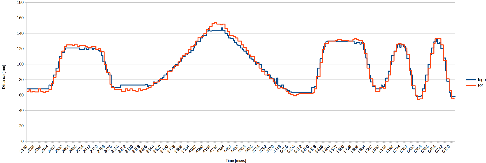

# Using a VL53L0X laser distance sensor with the [LMS-ESP32 board](https://www.antonsmindstorms.com/product/wifi-python-esp32-board-for-mindstorms/) from Antons Mindstorms and LEGO&reg; Spike running [Pybricks](https://pybricks.com/)

If you only want to connect a single VL53L0X and expose it as a LEGO compatible sensor, follow [Antons article](https://www.antonsmindstorms.com/2024/05/02/lego-with-a-laser-distance-sensor/).

If you want to connect multiple sensors and expose them with PUPRemote framework, start with below example that compares LEGO ultrasonic distance sensor with VL53L0X laser distance aka. time of flight sensor.

As already mentioned in Antons article, the VL35L0X by default needs ~30msec for a measurement. 

To achieve highest sensor measurement rate, use a separate _read_ thread.
The Pybricks `rh.call('tof')` reads the latest value each ~13 msec. 

If using `vl53l0x.read()` in `tof()` function instead of using a thread, the Pybricks side would have to use `rh.call('tof', wait_ms=30)` which would result in a roundtrip time over 40 msec.

## LMS-ESP32 code:

```python
from machine import SoftI2C, Pin
from pupremote import PUPRemoteSensor
from VL53L0X import VL53L0X # https://github.com/antonvh/PUPRemote/blob/main/examples/emulate_dist_sensor/VL53L0X.py
import _thread

class VL53L0XThread:
    def __init__(self, device: VL53L0X):
        self.device = device
        self.value = 0
        self.enabled = False

    def _run(self):
        self.device.start()
        while self.enabled:
            self.value = self.device.read()
        self.device.stop()
        self.value = 0

    def start(self):
        self.enabled = True
        _thread.start_new_thread(self._run, ())

    def stop(self):
        self.enabled = False

    def get(self):
        return self.value

vl53l0x = VL53L0X(SoftI2C(scl=Pin(4), sda=Pin(5), freq=200000))
vl53l0xThread = VL53L0XThread(vl53l0x)

def tof(): 
    return vl53l0xThread.get()

def tofOn(on):
    if on:
        vl53l0xThread.start()
    else:
        vl53l0xThread.stop()
  
rs = PUPRemoteSensor(power=True)
rs.add_command('tof', 'H', '')
rs.add_command('tofOn', '', 'B')

while True:
    rs.process()
```

Add a file named `VL53L0X.py` with content from https://github.com/antonvh/PUPRemote/blob/main/examples/emulate_dist_sensor/VL53L0X.py

## Pybricks code:

```python
from pybricks.pupdevices import UltrasonicSensor
from pybricks.parameters import Port
from pybricks.tools import StopWatch
from pupremote_hub import PUPRemoteHub # https://github.com/antonvh/PUPRemote/blob/main/src/pupremote_hub.py

sw = StopWatch()
us = UltrasonicSensor(Port.B)
rh = PUPRemoteHub(Port.A)
rh.add_command('tof', 'H', '')
rh.add_command('tofOn', '', 'B')

print('time; lego; tof')
rh.call('tofOn', 1)
while True:
    a = us.distance()
    b = rh.call('tof')
    print(f'{sw.time()}; {a}; {b}')
```

## Comparison

Values look comparable and there is nearly no lagging of vl53l0x data that is processed by the LMS-ESP32 first.


## Misc

The VL53L0X i used, behaved a bit strange.
- It reported values ~15mm larger
- The values for `set_measurement_timing_budget` are not as documented. With values below ~108 000 it returned `False`. I had to use:
  | value   | timing  |
  | ------- | ------- |
  |       0 | 30 msec |
  | 300 000 | 20 msec |
  | 200 000 | 50 msec |
I will check again with another device.
  

